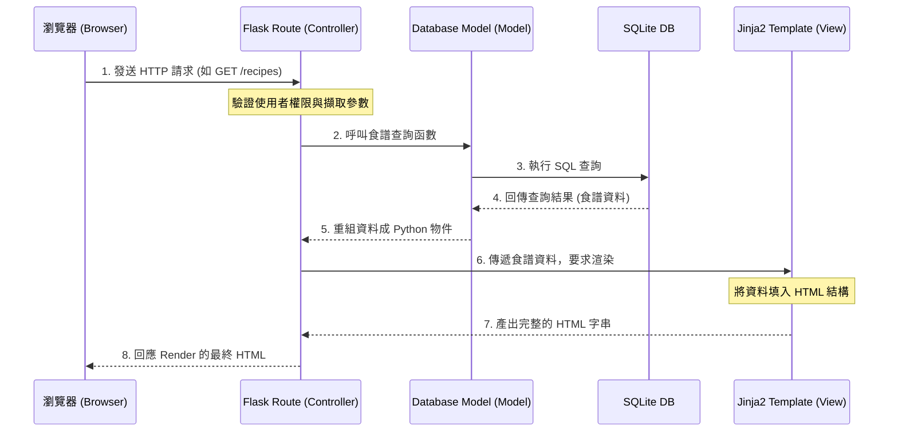

# 系統架構設計 (Architecture) - 食譜收藏夾

本文檔將基於產品需求文件（PRD）中的要求，說明「食譜收藏夾」專案的系統與技術架構、資料夾組織方式以及各元件間的協作關係。

## 1. 技術架構說明

本專案採用經典的伺服器端渲染（Server-Side Rendering）架構，選用以下技術棧：

- **後端框架：Python + Flask**
  - **原因**：Flask 是一套輕量且靈活的網頁框架，適合中小型專案或快速建立 MVP（最低可行性產品）。其簡單的路由與擴充套件生態系非常適合用於教學與初期的專案開發。
- **模板引擎：Jinja2**
  - **原因**：Jinja2 是 Flask 預設搭配的強大模板引擎，它負責整合後端傳遞的資料結構與前端的 HTML 語法，產生最終的動態網頁。此設計不需要前端框架（如 React/Vue）也能快速構建介面。
- **資料庫：SQLite**
  - **原因**：SQLite 是一套輕型的關聯式資料庫，它將資料直接存放在檔案中（不需要額外架設資料庫伺服器），適合快速開發、測試與輕量級應用。

### Flask MVC 模式說明

我們將專案結構劃分為近似 MVC（Model-View-Controller）的設計模式來分離職責：
- **Model（資料模型 / 資料庫互動）**：負責定義資料表結構以及所有與資料庫存取（Insert, Update, Delete, Select）相關的邏輯。
- **View（使用者視圖 / Jinja2 模板）**：負責使用者的介面呈現，接收使用者輸入，並向開發者所撰寫好的路由發送請求。
- **Controller（路由控制器 / Flask Routes）**：擔任溝通的橋樑，接收來自 View 的 HTTP 請求，調用對應的 Model 處理資料，最後將資料再送回 View 準備好的模板進行渲染。

---

## 2. 專案資料夾結構

以下為建議且符合 Flask 標準的專案檔案目錄結構：

```text
web_app_development/
├── app/                      ← 應用程式主目錄
│   ├── __init__.py           ← 初始化 Flask 實體與相關擴充
│   ├── models/               ← 資料庫模型目錄 (Model)
│   │   ├── __init__.py
│   │   ├── user.py           ← 會員帳號的資料結構與相關操作
│   │   └── recipe.py         ← 食譜相關資料表結構與 CRUD 操作
│   ├── routes/               ← 路由與控制器目錄 (Controller)
│   │   ├── __init__.py
│   │   ├── auth_routes.py    ← 註冊、登入登出的路由
│   │   └── recipe_routes.py  ← 食譜新增、觀看、分享與列表的路由
│   ├── templates/            ← HTML 模板目錄 (View)
│   │   ├── base.html         ← 共用的網頁母版（包含導覽列、頁首外觀）
│   │   ├── index.html        ← 首頁（公開食譜牆平台）
│   │   ├── auth/             ← 憑證與會員專屬頁面
│   │   │   ├── login.html
│   │   │   └── register.html
│   │   └── recipe/           ← 食譜相關視圖
│   │       ├── dashboard.html    ← 我的收藏夾
│   │       ├── create.html       ← 新增/編輯食譜頁面
│   │       └── detail.html       ← 觀看特定食譜的詳細頁面
│   └── static/               ← 靜態資源目錄 (CSS/JS/圖片)
│       ├── css/
│       │   └── style.css     ← 網站共用樣式表
│       ├── js/
│       │   └── main.js       ← 前端互動邏輯（如表單驗證等）
│       └── images/           ← 測試或預設照片
├── instance/                 ← 存放敏感情資或執行時產生的本機檔案
│   └── database.db           ← SQLite 實體資料庫檔案
├── docs/                     ← 開發與系統文件
│   ├── PRD.md                ← 產品需求文件
│   └── ARCHITECTURE.md       ← 本系統架構文件
├── app.py                    ← 整個專案的進入點 (Entry Point)
├── requirements.txt          ← 專案依賴的所有 Python 套件清單
└── README.md                 ← 專案介紹與啟動使用說明
```

---

## 3. 元件關係圖

透過下方的流程圖，可以了解當用戶與系統互動時，各個核心元件的溝通方式與資料流向。



---

## 4. 關鍵設計決策

1. **傳統伺服器端渲染 (SSR) 而非前後端分離 (SPA)**
   - **原因**：對於內容展示為主的平台（如食譜網站），SSR 對搜尋引擎（SEO）較好；再者，在初期開發或團隊規模較小時，專注於 Flask + Jinja2 能夠以更低的成本推動專案並極大化產出速度。
   
2. **採用藍圖 (Blueprints / 分組路由設計)**
   - **原因**：如目錄結構所見，我們將路由依照功能拆分成 `auth_routes.py` 與 `recipe_routes.py`。即便專案初期規模小，使用分模組路由可以保持程式碼整潔，容易讓團隊分工，且避免上千行程式碼擠在同一個檔案內難以維護。
   
3. **選擇 SQLite 作為初期單一資料庫方案**
   - **原因**：不需要設定環境與專用 Port 即可馬上執行。作為 MVP 網站，在資料庫處理流量較低或讀取大於寫入時，它的效能完全足夠撐起網站運作，並具備簡單移轉的特性。
   
4. **前端不引入大型 CSS 框架（看需求而定，但先預設輕量）**
   - **原因**：為保留高度的設計靈活性以滿足「Wow 現象」，預設先採用有規劃地編寫原生的 Vanilla CSS，或者只使用輕量化的排版支援，好讓網站保留獨特、吸睛的視覺與互動設計。
