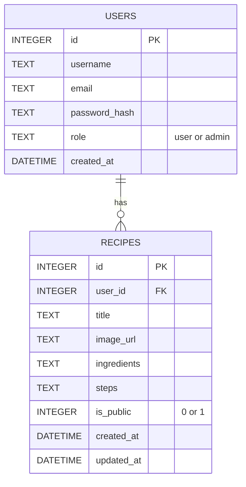

# 資料庫設計文件 (DB_DESIGN) - 食譜收藏夾

## ER 圖 (實體關係圖)

## 資料表詳細說明

### USERS (使用者表)
紀錄註冊會員的資訊。
- `id` (INTEGER): 主鍵，自動遞增
- `username` (TEXT): 使用者名稱，必填
- `email` (TEXT): 電子信箱，必填且唯一 (Unique)
- `password_hash` (TEXT): 雜湊後的密碼，必填
- `role` (TEXT): 角色權限，預設為 `user`，可為 `admin`，必填
- `created_at` (DATETIME): 註冊時間，必填

### RECIPES (食譜表)
紀錄每份食譜的內容與公開狀態。
- `id` (INTEGER): 主鍵，自動遞增
- `user_id` (INTEGER): 外鍵，關聯至 USERS.id，必填
- `title` (TEXT): 食譜標題，必填
- `image_url` (TEXT): 食譜圖片的網址，非必填
- `ingredients` (TEXT): 食材清單，必填
- `steps` (TEXT): 製作步驟，必填
- `is_public` (INTEGER): 是否公開 (1: 公開, 0: 私密)，必填，預設為 0
- `created_at` (DATETIME): 建立時間，必填
- `updated_at` (DATETIME): 最後更新時間，必填
