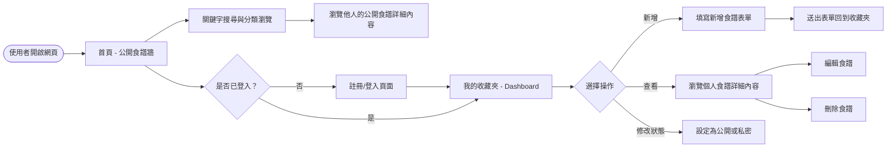
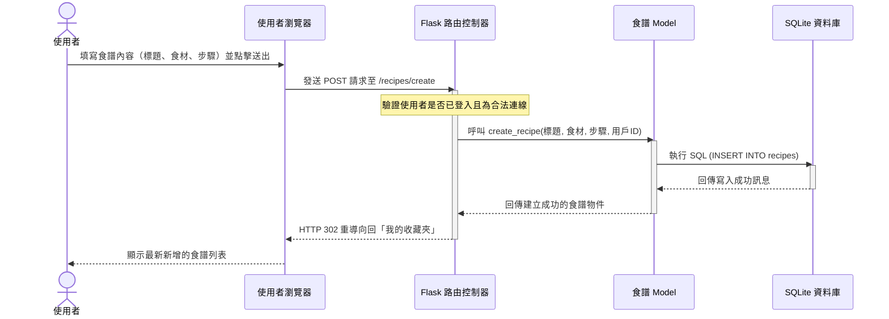

# 流程圖文件 (FLOWCHART) - 食譜收藏夾

本文檔基於 **docs/PRD.md** 與 **docs/ARCHITECTURE.md** 所描述的需求與架構，以視覺化的方式展示使用者的操作流程（User Flow）、系統內部的處理順序（Sequence Diagram）以及對應的功能清單對照表。

---

## 1. 使用者流程圖（User Flow）

此流程圖描述使用者從進入食譜收藏夾網站開始，能夠執行的所有主要操作路徑，包含瀏覽、登入、新增食譜及管理個人收藏。

---

## 2. 系統序列圖（Sequence Diagram）

此序列圖描述「**使用者點擊新增食譜**」到「**資料存入資料庫**」的完整後端資料流與互動流程。角色包含使用者瀏覽器、Flask 路由控制器、資料庫模型與 SQLite。

---

## 3. 功能清單對照表

以下表格對應了主要功能與其負責的 URL 路徑及 HTTP 方法，提供開發前後端介面串接的參考基準：

| 主要功能分類 | 具體操作 | URL 路徑 (Route) | HTTP 方法 | 備註說明 |
| :--- | :--- | :--- | :--- | :--- |
| **首頁與探索** | 瀏覽公開食譜牆 | `/` | `GET` | 系統首頁，展示設為公開的食譜 |
| | 搜尋食譜 | `/search` | `GET` | 帶入 `?q=關鍵字` 進行搜尋過濾 |
| | 觀看特定食譜詳細 | `/recipes/<id>` | `GET` | 可見度取決於是否公開或是作者本人 |
| **會員管理** | 使用者註冊 | `/auth/register` | `GET`, `POST` | GET 顯示表單；POST 處理註冊邏輯 |
| | 使用者登入 | `/auth/login` | `GET`, `POST` | GET 顯示表單；POST 建立 Session |
| | 使用者登出 | `/auth/logout` | `POST` 或 `GET` | 清除 Session 並導向首頁 |
| **我的收藏夾** | 查看個人的食譜列表 | `/dashboard` | `GET` | 需登入狀態，僅列出自己的食譜 |
| | 新增食譜 | `/recipes/create` | `GET`, `POST` | GET 顯示表單；POST 寫入資料庫 |
| | 編輯食譜 | `/recipes/<id>/edit` | `GET`, `POST` | 取巧可使用 POST ；如支援可為 PUT |
| | 刪除食譜 | `/recipes/<id>/delete`| `POST` | 因瀏覽器限制，常以 POST 替代 DELETE |
| | 切換公開/私密狀態 | `/recipes/<id>/toggle`| `POST` | 更新食譜的 visibility 狀態 |
